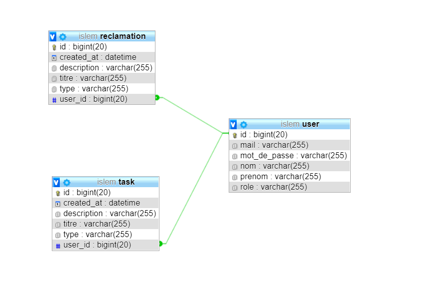
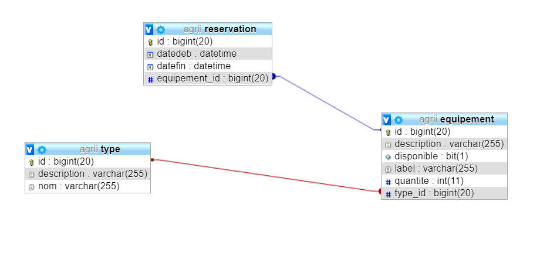
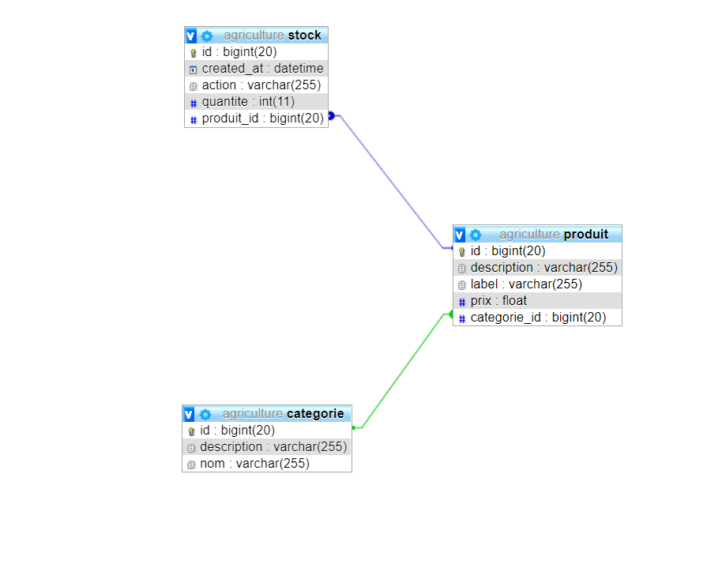
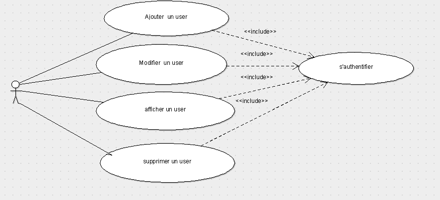
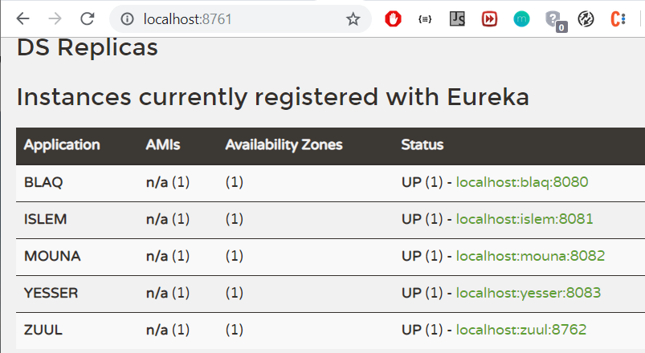

# Agriculture Project
## Conception of  Project : 
### Our Class Diagram : 

### User Management (`Islem Work`):


### Equipment Management (`Yesser Work`):


### Product Management (`Wahb Work`):


### Our Use Case Diagram : 

### User Management (`Islem Work`):


### You can find all of diagrams [HERE](conception/)


## Configuration envirement :
### 1st STEP : Clone the project :
```console
git clone https://github.com/cherchariwahb/Micro_service_Prooject.git
```
### 2nd STEP :`Don't forget : Maven Update`
### 3rd STEP : 
#### Run Eureka project (GROUP Work)
Make sur you run project on `--server.port=8761`
#### Run blaq project (WAHB Work)
Make sur you run project on `--server.port=8080`
#### Run yesser_copie project (YESSER Work)
Make sur you run project on `--server.port=8082`
#### Run islem project (ISLEM Work)
Make sur you run project on `--server.port=8081`
#### Run mouna project (MOUNA Work)
Make sur you run project on `--server.port=8083`
#### Run Zuul project (GROUP Work)
Make sur you run project on `--server.port=8762`
### Result Like this (^_^)


## Testing Project : `using postman`
### 


